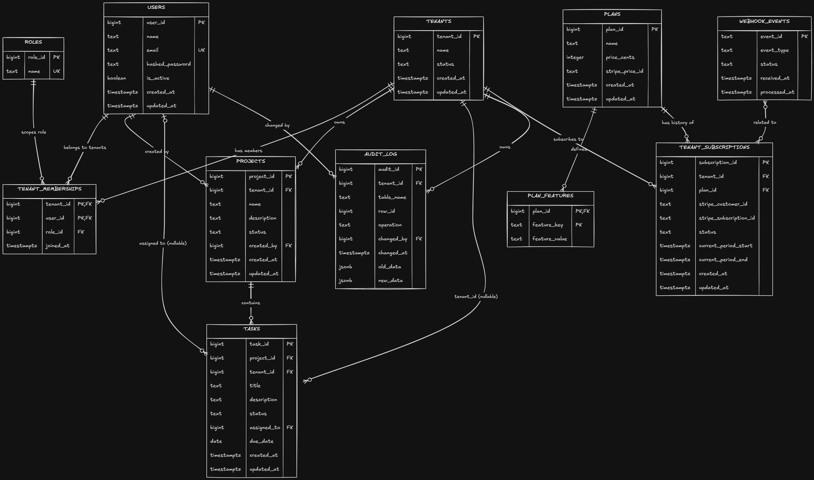

# ER Diagram 

11 tables, grouped by concern:

- **Identity & tenancy:** `tenants`, `users`, `roles`, `tenant_memberships`. The many-to-many between users and tenants goes through `tenant_memberships` — deliberately not a `tenant_id` column on `users` — because a user can belong to more than one tenant, and role is scoped per membership row, not per user. Same person can be `owner` in one tenant and `member` in another.
- **Business resource:** `projects`, `tasks` — the pair that actually proves RLS and RBAC work end-to-end, not just in theory. `tasks.tenant_id` is denormalized on purpose: it keeps the RLS policy a single-column check with no join required in the security path.
- **Audit:** `audit_log`. `row_id` is *not* a real foreign key — it's a polymorphic reference (`table_name` + `row_id` together point at "whichever row"), a deliberate trade-off for audit-log flexibility over referential integrity on that column.
- **Billing:** `plans`, `plan_features`, `tenant_subscriptions`, `webhook_events`. `plan_features` is key-value shaped rather than fixed columns, same reasoning as `roles` being a lookup table — a new plan limit is a row insert, not a migration. `tenant_subscriptions.tenant_id` is intentionally *not* unique, since a tenant can cancel and resubscribe and the history is preserved. `webhook_events` has no FK relationships at all — it's an idempotency ledger keyed on Stripe's own `event_id`, not a domain entity.

One deliberate gap: `tenant_memberships` has no RLS policy. `TenantContextFilter` has to query that table *before* `SET LOCAL` has run — applying RLS to it would return zero rows for every legitimate user, a bootstrap chicken-and-egg problem. Worth stating outright if asked, since it looks like an oversight until you explain the ordering constraint that causes it.